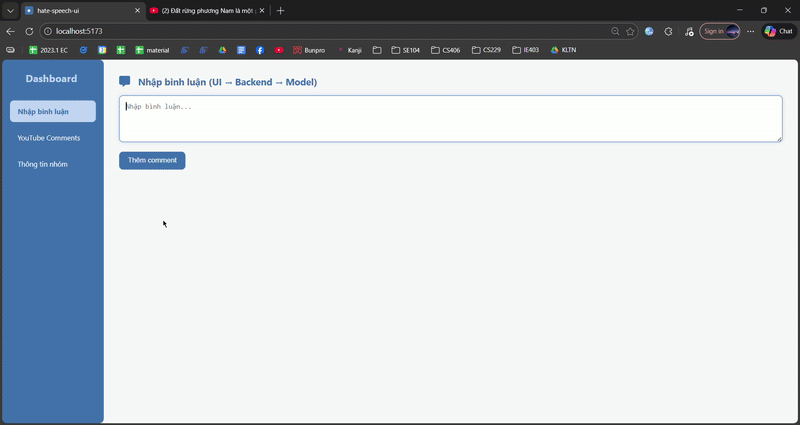

<p align="center">
  <a href="https://www.uit.edu.vn/" title="University of Information Technology" style="border: none;">
    
  </a>
</p>

<h1 align="center"><b>IE403.Q11 - Social Media Mining</b></h1>

# **IE403 Course Project: Hate Speech Detection and Highlighting for Vietnamese with Rationale Extraction (HARE)**

> This repository contains the full implementation of **HARE**, a framework designed to detect and explain hate speech in Vietnamese social media text. Developed for the course **IE403.Q11 – Social Media Mining** at the University of Information Technology (UIT – VNU-HCM).  
>  
> The project focuses on **Explainable AI (XAI)** by utilizing **Large Language Models (LLMs)** and **Chain-of-Thought (CoT)** prompting to not only classify hate speech but also extract rationales and implied statements. We leverage the **Qwen2.5-3B** model fine-tuned with **QLoRA** to achieve state-of-the-art performance.
>
> Full project is available on OneDrive: https://nklod-my.sharepoint.com/:f:/g/personal/phatxinhchao_nklod_onmicrosoft_com/IgAYGfiHj2ZsTpr2aebNbSfrAVG0YJ0LkziTmToc1uIn1oY?e=nnp26c


<p align="center">
  
</p>

---

## **Team Information**
| No. | Student ID | Full Name | Role | Github | Email |
|----:|:----------:|-----------|------|--------|-------|
| 1 | 23521143 | Nguyen Cong Phat | Leader | [paht2005](https://github.com/paht2005) | 23521143@gm.uit.edu.vn |
| 2 | 23520032 | Truong Hoang Thanh An | Member | [Awnpz](https://github.com/Awnpz) | 23520032@gm.uit.edu.vn  |
| 3 | 23520023 | Nguyen Xuan An | Member | [annx-uit](https://github.com/annx-uit) |  23520023@gm.uit.edu.vn  | 
| 4 | 23520158 | Mai Thai Binh | Member | [maibinhkznk209](https://github.com/maibinhkznk209/) |  23520158@gm.uit.edu.vn  | 
| 5 | 21520255 | Nguyen Le Quynh Huong | Member | [tracycute](https://github.com/tracycute) |  21520255@gm.uit.edu.vn  | 


---


## **Table of Contents**
- [Features](#features)
- [Dataset](#dataset)
- [Repository Structure](#repository-structure)
- [Application Preview](#application-preview)
- [Methodology](#methodology)
- [Installation](#installation)
- [Usage](#usage)
- [Results](#results)
- [Demo](#demo)
- [Conclusion](#conclusion)
- [License](#license)

---

## **Features**
- **Hate Speech Classification:** Binary classification (Censored/Uncensored) for Vietnamese social media comments.
- **Rationale Extraction:** Automatically highlights specific spans of text that trigger the hate speech label.
- **Implied Statement Inference:** Decodes sarcasm and toxic metaphors into clear, literal statements.
- **Fine-tuned LLM:** Custom fine-tuning of **Qwen2.5-3B-Instruct** using **QLoRA** on a specialized rationale dataset.
- **Full-stack Application:**
  - **FastAPI Backend:** Supports streaming responses and real-time inference.
  - **React + Vite Frontend:** Interactive UI for visualizing highlighted toxic spans.

---

## **Dataset**
- **Core Dataset:** ViTHSD (Vietnamese Toxic Hate Speech Dataset).
- **Rationale Enhancement:** 2,333 samples were enriched with rationales and implied statements using GPT-4o.
- **Label Structure:** Each comment is annotated in the format `[target]#[level]`, allowing multi-label classification across five targets (Individuals, Groups, Religion, Race/Ethnicity, Politics).
- **Data splits:**
  - `dataset/raw/`: Original ViTHSD files in `.xlsx` format.
  - `data/processed/dataset_rationale.json`: The final processed dataset used for fine-tuning.

---

## **Repository Structure**
```
IE403.Q11_Hate-Speech-Detection-and-Highlighting-for-Vietnamese-Project/
├── dataset/
│   ├── raw/                        # Original ViTHSD .xlsx files
│   └── processed/                  # dataset_rationale.json for training
│
├── research/
│   ├── notebooks/                      # Experiments and training steps
│   │   ├── base-phobert.ipynb          # Baseline 1: Training and evaluating PhoBERT model
│   │   ├── base-flant5.ipynb           # Baseline 2: Text-to-text approach using Flan-T5
│   │   ├── base-qwen.ipynb             # Baseline 3: Performance of Qwen2.5 (Zero-shot/Vanilla)
│   │   ├── qwen_rationale.ipynb        # Main: Fine-tuning Qwen with rationale (The HARE model)
│   │   └── test_prompts.ipynb          # Prompt Engineering: Testing different prompt versions
│   │
│   ├── src/                            # Modular source code for research
│   │   ├── config.py                   # Centralized configuration (hyperparameters, paths)
│   │   ├── data_preparation.py         # Pipeline to convert Excel/JSON to training format
│   │   ├── models.py                   # Model architecture and LoRA/QLoRA configuration
│   │   └── evaluation.py               # Custom metrics (F1-score, span-level evaluation)
│   │
│   └── prompts/                        # Prompt versioning (v1, v2, final)
│       ├── v1_initial/
│       ├── v2_refined/
│       └── v3_final/                   # Best prompts used in the final system
│
├── app-preview/
│   ├── frontend-snippet/
│   │   └── index.html           # UI layout template for the detection dashboard
│   │
│   ├── backend-logic/           # Core FastAPI implementation
│   │   ├── main.py              # API entry point, routing, and YouTube integration
│   │   ├── model.py             # LLM inference engine & rationale parsing logic
│   │   ├── highlight.py         # Advanced algorithm for toxic span mapping (NFC Normalized)
│   │   ├── schemas.py           # Pydantic data models for request/response validation
│   │   ├── youtube.py           # Integration with YouTube Data API v3
│   │   ├── config.py            # Environment settings and model hyperparameters
│   │   └── models.py            # (From Research) Base architecture definitions
│   │
│   └── sample-outputs/          
│       ├── results_datasetA_qwen_stage2.json  # Comprehensive test results (Labels + Rationales)
│       └── __huggingface_repos__.json         # Metadata for Hugging Face model integration
├── demo/                           # Full Application (Stored on OneDrive)
│   ├── frontend/                   # React + Vite source code
│   ├── backend/                    # FastAPI server code
│   └── output/                     # Local logs and sample outputs
│
├── IE403.Q11-Nhom2_report.pdf            # Detailed academic report
├── IE403.Q11-Nhom2_slide.pdf            # Presentation slides
├── requirements.txt                # Global Python dependencies
├── .gitignore                      # Git exclusion rules (Excludes 1.7GB demo folder)
├── LICENSE
├── thumbnail.png     
└── README.md                       # Main project documentation

```

---
## **Application Preview**
For those who wish to examine the core logic without downloading the full 1.7GB demo package (which includes the quantized model weights), we provide a comprehensive source preview in the `/app-preview` folder:

**Backend Logic (`/app-preview/backend-logic`)**
- `main.py`: The API gateway using **FastAPI**. Manages asynchronous requests and YouTube integration.
- `model.py`: The inference engine. Implements thread-safe model loading and parses CoT outputs into structured labels.
- `highlight.py`: The "Highlighting" algorithm. Uses **Unicode Normalization (NFC)** to accurately map model rationales back to original text spans.
- `schemas.py` & `youtube.py`: Pydantic data models for API validation and YouTube Data API v3 wrappers.

**Frontend Structure (`/app-preview/frontend-snippet`)**
- `index.html`: The main entry point for the React dashboard.
- Includes modular component logic for real-time span highlighting based on model confidence scores.

**Sample Results (`/app-preview/sample-outputs`)**
  `results_datasetA_qwen_stage2.json`: Contains full test set predictions, showing exactly how the fine-tuned model explains its decisions.

  
---
## **Methodology**

### 1. Fine-tuning Pipeline
We utilize **QLoRA (Quantized Low-Rank Adaptation)** to fine-tune **Qwen2.5-3B-Instruct** in a 4-bit quantized format, allowing high performance on consumer-grade GPUs.

### 2. Chain-of-Thought (CoT) Prompting
To improve the model's reasoning, we implemented a multi-stage prompt strategy:
- **Phase 1 (Rationale):** Identify why the text is toxic.
- **Phase 2 (Implied Statement):** Translate hidden toxic meanings.
- **Phase 3 (Labeling):** Final classification based on the extracted evidence.
### 3. Two-Stage Semantic Alignment Training

- **Stage 1:** Fine-tune Qwen2.5 on ViTHSD labels to learn decision boundaries.
- **Stage 2:** Continue training with rationale and implied statement data to align semantic reasoning with classification outputs.

This strategy helps the model move beyond surface-level keyword matching and improves its ability to detect implicit hate speech.
### 4. Comparison Models (Baselines)
We compared our HARE framework against:
- **PhoBERT-base:** Traditional Encoder-only transformer.
- **Flan-T5-base:** Encoder-Decoder model for text-to-text tasks.

### 5. Demo System Architecture

The HARE demo is a full-stack application designed for real-time hate speech analysis.

#### Frontend (React + Vite)
- **Component-Based UI**: Organized with modular components like `Sidebar`, `GroupInfo`, and `InputComment`.
- **YouTube Integration**: Features a `YoutubeComments` component that allows users to fetch and analyze comments directly from YouTube URLs.
- **Dynamic Highlighting**: Real-time rendering of toxic spans based on the rationale provided by the backend.

#### Backend (FastAPI)
- **Asynchronous Processing**: Handles LLM inference requests efficiently.
- **LLM Streaming**: Supports streaming the Rationale generation process for a better user experience.
- **YouTube API**: Integrated to scrape and process comments on the fly.

#### Tech Stack
- **Frontend**: React.js, Vite, Tailwind CSS, Lucide React (icons).
- **Backend**: FastAPI, Uvicorn, Hugging Face Transformers.
- **Deployment**: Dockerized environment (Dockerfile included).


---

## **Installation**

### 1. Clone repository
```bash
git clone https://github.com/paht2005/IE403.Q11_Hate-Speech-Detection-and-Highlighting-for-Vietnamese-Project.git
cd IE403.Q11_Hate-Speech-Detection-and-Highlighting-for-Vietnamese-Project
```
### 2. (Optional) Create virtual environment
```bash
python -m venv .venv
source .venv/bin/activate      # Linux / Mac
.venv\Scripts\activate         # Windows

```
### 3. Install dependencies
```bash
pip install -r requirements.txt
```

### 4. Setup Demo (External Storage)
Due to the model weight size (~1.7GB), the `demo/` folder must be downloaded from OneDrive:
- **Link:** https://nklod-my.sharepoint.com/:f:/g/personal/phatxinhchao_nklod_onmicrosoft_com/IgAYGfiHj2ZsTpr2aebNbSfrAVG0YJ0LkziTmToc1uIn1oY?e=nnp26c
- After downloading, extract the folder into the project root.

--- 

## **Usage**
### 0. Important Notes
- **Notebook Environment (Kaggle):** All training notebooks in `research/notebooks/` were originally developed and executed on **Kaggle** to leverage its GPU resources (P100/T4). If you are running these locally or on Google Colab, ensure you have sufficient VRAM (at least 16GB recommended for Qwen2.5-3B fine-tuning).
- **Path Configuration:** Due to the reorganization of this repository for academic submission, the file paths within the `.ipynb` files may not match the current folder structure.
  - **Default Path in Notebooks:** Usually points to `/kaggle/input/...` or the previous local structure.
  - **Required Action:** If you wish to re-train or run inference, please update the `DATA_PATH` or file loading cells to point to: `../../dataset/processed/dataset_rationale.json`
- **Demo Folder:** Remember that the `demo/` folder is excluded from Git via `.gitignore.` You must manually download it from the provided OneDrive link and place it in the root directory for the application to function
### 1. Training & Research
Navigate to the research folder to reproduce experiments:
```bash
cd research/notebooks
jupyter notebook qwen_rationale.ipynb
```

### 2. Running the Demo
**Backend:**
```bash
pcd demo/backend
python main.py
```
**Frontend:**
```bash
cd demo/frontend
npm install
npm run dev

```

---
## **Results**


### Overall Performance on ViTHSD Test Set

We evaluate our proposed **HARE framework (Qwen2.5 fine-tuned with Rationales)** against strong baseline models on the **ViTHSD test set**, using **Precision, Recall, and F1-score (Micro)** as the primary evaluation metrics.

| Model | Precision (Micro) | Recall (Micro) | F1-score (Micro) |
|------|------------------|---------------|------------------|
| PhoBERT-base | 0.5620 | 0.5310 | 0.5412 |
| Flan-T5-base | 0.4810 | 0.4520 | 0.4684 |
| Qwen2.5 (Vanilla, Stage 1 only) | 0.6100 | 0.5600 | 0.5900 |
| **HARE (Qwen2.5 + Rationales, Stage 1 + 2)** | **0.6347** | **0.5735** | **0.6026** |

**Overall**, the results demonstrate that incorporating rationale-based reasoning consistently improves both interpretability and classification robustness, particularly for implicit and politically sensitive hate speech.

**Key observations:**

- **HARE achieves the best overall F1-score (60.26%)**, outperforming:
  - **PhoBERT-base** by **+6.14%**
  - **Flan-T5-base** by **+13.42%**
- Compared to **Qwen Vanilla**, incorporating **rationale-based semantic alignment** leads to:
  - **+1.26% F1-score**
  - **+2.47% Precision**, helping reduce false positives.
- Higher Precision is particularly important in **content moderation**, where incorrectly flagging non-toxic comments can negatively impact user experience.

---

### Impact of Rationales on Challenging Labels

Although the overall improvement is moderate, **the main strength of HARE appears in difficult and low-resource categories**, where traditional models struggle.

| Label (Hate) | PhoBERT | Qwen Vanilla | **HARE (Qwen + Rationales)** |
|-------------|--------|-------------|-----------------------------|
| Individuals | 0.5365 | 0.6190 | **0.6166** |
| Groups | 0.4603 | 0.4583 | **0.5344** |
| **Politics** | **0.2913** | **0.3659** | **0.5400** |
| Race / Ethnicity | 0.2857 | **0.3288** | 0.2817 |

#### Political Hate Speech (Most Significant Gain)

Political hate speech is one of the hardest categories due to:
- Heavy use of **political slang** (e.g., *“ba que”, “bò đỏ”*)
- **Metaphors and implicit attacks**
- Strong dependence on **cultural and historical context**

HARE achieves:
- **+17.41% F1-score** compared to Qwen Vanilla
- **+24.87% F1-score** compared to PhoBERT

This result confirms that **Implied Statements and Chain-of-Thought reasoning help the model decode hidden political meanings**, rather than relying solely on surface-level keywords.

---

### Why Rationales Matter

From our experiments, we observe that:

- **PhoBERT**, trained on formal text (Wikipedia, news), struggles with informal Vietnamese social media language.
- **Vanilla LLM fine-tuning** improves general performance but still relies heavily on lexical cues.
- **Rationale-enhanced training (HARE)** enables the model to:
  - Align **implicit meaning** with explicit labels
  - Better handle sarcasm, memes, and metaphors
  - Generalize more effectively on **minority and high-risk targets**

However, performance on **Race/Ethnicity#Hate** remains limited due to **severe data sparsity**, highlighting that **Chain-of-Thought reasoning cannot fully compensate for insufficient training data**.

---

### Qualitative Example

**Input Comment:** `Thằng này nhìn mặt hãm tài quá, cút đi cho rảnh nợ.`

**Prediction:** `Hate`

- **Rationale:** The comment uses degrading language toward appearance (“hãm tài”) and explicit rejection (“cút đi”, “rảnh nợ”).
- **Implied Statement:** The speaker is directly attacking and expressing hostility toward the target.

This example illustrates how **HARE provides both accurate predictions and human-interpretable explanations**, aligning with the goals of **Explainable AI (XAI)**.

---

## **Demo**

The interactive web demo allows users to:
1. Input a Vietnamese social media comment.
2. View the real-time classification (Censored/Uncensored).
3. See **highlighted text spans** that the model identified as toxic.
4. Read the model's generated **explanation** for its decision.

The highlighted toxic spans are directly derived from the generated rationales, ensuring alignment between model explanations and visual outputs.

A screenshot of the demo interface is available at:

```text
live-demo.gif
```
<p align="center">
  
</p>

---
## **Conclusion**
- Successfully built a Vietnamese hate speech detection system with high interpretability.
- Proved that LLMs fine-tuned with rationales significantly outperform traditional BERT-based models.
- Provided a modular framework for future research in Vietnamese XAI (Explainable AI).
 
---
## **License**
This project is for academic use in the course **IE403.Q11 - Social Media Mining** at the University of Information Technology (UIT – VNU-HCM).

This project is licensed under the MIT License. See the [LICENSE](./LICENSE) file for details.

